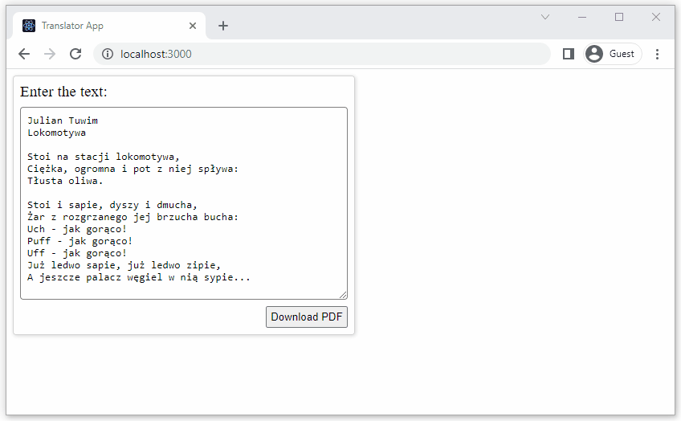

# Translator App (React + Express.js)

## Functionalities

-   the application receives the text provided by the user in the `<textarea>` element,
-   translates it into the given languages (English, German, Spanish) using [translate](https://www.npmjs.com/package/translate?activeTab=readme) package,
-   creates a PDF file where the translation from each language is on a separate page using [pdf-lib](https://www.npmjs.com/package/pdf-lib) package,
-   forces the PDF file download.

## Installation

### Installing application dependencies

Inside the application there are `backend/` and `frontend/` folders, inside which dependencies should be installed by running the following command in each of them in the console (terminal):

```
npm ci install
```

## Development version

In the `frontend/` folder, execute the following command:

```
npm start
```

In the `backend/` folder, run:

```
npm run devStart
```

In a web browser, open application using:

```
http://localhost:3000
```

## Preview


